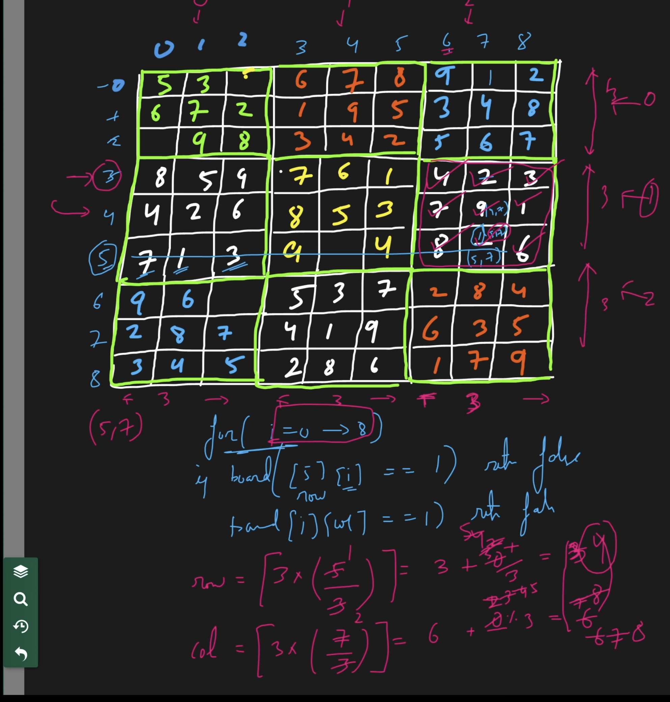
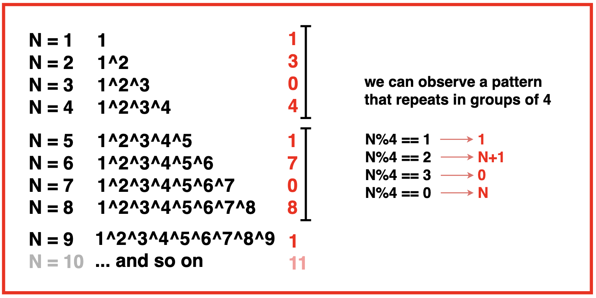

# Points to note

1. We must be careful that we will not manipulate the given data. A company may use the same data for different purposes. So, we will never manipulate the given data i.e. the inputs until the interviewer specifically says so.

2.  In CP or in the platforms like Leetcode and GeeksforGeeks, we generally run our codes on online servers. Most of these servers execute roughly **10<sup>8</sup>** (i.e. 1 crore) operations in approximately **1_second** i.e. 1s. 

     - We must be careful that if the time limit is given as **2s** the operations in our code must be roughly **2 * 10<sup>8</sup>**, not 10<sup>16</sup>. 
     
     - Simply, if we want our code to be run in **1s**, the time complexity of our code must be around **O(10<sup>8</sup>)** avoiding the constants and the lower values.

3. 10<sup>8</sup> operations take 1 second to get executed. So, 10<sup>10</sup> operations will take around 100 seconds(10<sup>10</sup>/10<sup>8</sup>). Code will get TLE if it takes 100 seconds to get executed.

4. C++ `Data-types` ref: https://www.programiz.com/cpp-programming/data-types

5. **Switch statementsS:** 

    A switch statement necessitates that its expression results in a **constant** value. This can include constants and arithmetic operations. 

    Ensure that the expression provides values of type `int` or `char` or `enum`. Switch statements in *C* or *C++* are exclusively designed to handle integer, character or enum values only.
 
6. The rate at which the time, required to run a code, changes with respect to the input size, is considered the time complexity. Time complexity of a particular code depends on the given input size, not on the machine used to run the code.

    

7. <span style="color: violet; font-size: 18px;">**Libraries:**</span>
     - **#include <bits/stdc++.h> :** Includes all popular library at once. But not available in all compilers.
     - std::swap() : swaps 2 pointers in the argument
     - #include<climits> : INT_MAX, INT_MIN
     - in c++ to get absolute value:
          ```cpp
               #include <cstdlib> // For int abs()
               #include <cmath>   // For float/double/long double

               int main() {
                    int int_num = -10;
                    double double_num = -5.5;

                    int abs_int = std::abs(int_num);

                    double abs_double = std::abs(double_num);
               }
          ```
     - 

8. <span style="color: violet; font-size: 18px;">**Shortcuts:** </span>
     - Initializing array filled with default values: int hash[13] = {0};
     - To print as Booleans:
          ```c
               cout << std::boolalpha; 
               cout << true << endl;
               cout << std::noboolalpha;
          ```
     - To find max element in an array: {    int maxE= *max_element(arr.begin(),arr.end());   }
     - To create heap from array in O(N):
          ```cpp
               #include <algorithm>
               std::make_heap(arr.begin(), arr.end());
          ```
     - c++ priority_queue by default is max heap:
          ```cpp
               #include <queue>
               std::priority_queue<int> pq;
               // Add elements to the priority queue
               pq.push(30);
               pq.push(100);

               // Remove elements from the priority queue
               while (!pq.empty()) {
                    std::cout << "Popping: " << pq.top() << std::endl;
                    pq.pop();
               }
          ```
     -  To use it as min_heap:
          ```cpp
               #include <queue>
               std::priority_queue<int, std::vector<int>, std::greater<int>> minHeap;
               minHeap.push(30);
               minHeap.push(10);
               minHeap.push(50);
               minHeap.push(20);

               while (!minHeap.empty()) {
                    std::cout << minHeap.top() << " ";
                    minHeap.pop();
               }
          ```
     - To write **exponent** like 10^-6:
          ```c
               double diff = 1e-6;
          ```
     - proper alternative for (l+r)/2 :
          ```c
          int mid = l + (r - l) / 2;
          ```

     > NOTE: While using ceil DO NOT FORGET to cast to double: ceil((`double`)N / 2);

 
   - If you want to pass always the longer array into the 1st argument, just check which one is longer and swap arguments based upon that: 
     ```c
     if (m > n)
            return findMedianSortedArrays(nums2, nums1);
     ```
   - 
9. Array size limitations: 
     
     
10. If the string contains both uppercase and lowercase letters: We have 256 characters in total in this case. So, we will create a hash array of size **256**. Otherwise we can use hash[s[i]-’a’] OR hash[s[i]-’A’] and keep the hash array of 26 elements only.

11. In the map data structure, the data type of key can be anything like int, double, pair<int, int>, etc. But for unordered_map the data type is limited to integer, double, string, etc. We cannot have an unordered_map whose key is pair<int, int>. 

12. How to traverse map from end to start?
     Ans: 

     ```c++
          for(auto it=freq.rbegin(); it!=freq.rend(); it++){
            cout<<it->first<<endl;
          }
     ```

13. XOR properties:
     - XOR of two same numbers is always 0 i.e. a ^ a = 0. ←Property 1.
     - XOR of a number with 0 will result in the number itself i.e. 0 ^ a = a.  ←Property 2

14. Sub-array vs sub-sequence:
    - A subarray is a **contiguous** (consecutive) portion of an array.
    - A subsequence is a sequence of elements derived from the original array by deleting some elements **without changing the order** of the remaining elements.

15. When input array is given as sorted, then try to use Binary search.
16. When we have to find the <b>minimum</b> number which is greater than or equal to something, try to use Binary search. And vice-versa for largest number less than equals to something. And also perform the binary search on the range of that asked value only from its min to max range.
17. How to rotate an array or a string? (`O(N)`)
     - Use built-in function rotate(first,middle, last) where
       - first: fist iterator in the range of elements to rotate
       - last: last iterator in the range of elements to rotate
       - middle: Iterator pointing to the element that should apprear at the begining of the rotated range
     - Example to left-rotate a string ("abcde") by 3 positions. Output: "deabc"
     ```cpp
          string s = "abcde";
          int d=3;
          rotate(s.begin(), (s.begin()+d) , s.end());
          cout<<s<<endl;
     ```
     - Example to right-rotate a string ("abcde") by 3 positions. Output: "cdeab"
     
     ```cpp
          string s = "abcde";
          int d=3;  int N=s.length();
          rotate(s.begin(), (s.begin()+(N-d)) , s.end());
          cout<<s<<endl;
     ```

18. string substr (size_t pos = 0, size_t len = npos) const;
     - pos: Position of the first character to be copied as a substring.
     - len: Number of characters to include in the substring
     - Example: 
     ```cpp
          // left rotate by i places each at a time
          // abcde -> bcdea -> cdeab -> deabc -> eabcd -> abcde
          for(int i=0; i<N; i++){
            int d = i;
            string leftShiftedStr = s.substr(d,(N-d)) + s.substr(0, d);
            cout<<leftShiftedStr;
          }

          // Right rotate by i places each at a time
          // abcde -> eabcd -> deabc -> cdeab -> bcdea -> abcde
          for(int i=0; i<N; i++){
            int d = i;
            string rightShiftedStr = s.substr(N-d, d) + s.substr(0, (N-d));
            cout<<rightShiftedStr;
          }
     ```

19.  DO NOT concat strings in loops with '`+`' operator as each time it creates new string. Instead use **append()** or **push_back()** and **pop_back()** methods:
     ```cpp
          string ans;
          for(int i=255; i>=0; i--){
               int frequency = freq[i].first;
               char thisChar = freq[i].second;
               ans.append(frequency,thisChar);  // Appends char N times
          }
     ```
     OR
     ```cpp
          s.push_back('0');
          findStringsRecursively(s);
          s.pop_back();
     ```
     - To insert before the current string use `insert()`:
     ```cpp
          int N = s.size();
          string ans="";
          ans.reserve(N);     // **Pre reserve the size of string.

          stringstream ss(s);
          string inp;

          while(ss >> inp){
            if(ans=="") ans=inp;
            else {ans.insert(0," "); ans.insert(0,inp);}    // Use insert
          }
     ```

20. DO NOT pass strings **w/o** reference operator in method call from inside a loop. It creates new stirng in each method call and will give space limit reached error. Pass like below:
     ```cpp
          bool isPal(string& str){
               cout<< str[s];          
          }

          // Calling the above method
          string s = "madam";
	     cout<<isPal(s);
     ```
     - Also instead of saving strings in each iteration, try to save the index. Ex:
     ```cpp
          for(int i=0; i<N; i++){
            for(int j=i; j<N; j++){
                if(isPal(s,i,j)){
                    if((j-i+1)>maxLen){
                        maxLen = j-i+1;
                        ansL = i;  // instead of doing ans = s.substr(i, j-i+1) here
                        ansR = j;  // save the index
                    }
                }
            }
        }

        return s.substr(ansL, ansR-ansL+1);
     ```

21. How to detect integer overflow using only int variable? Below code is the answer:
    ```cpp
    bool isOverflow = (ans>INT_MAX/10) || (ans==INT_MAX/10 && curDigit>7);
    ```   

22. Note: c++ string method to check digit is: `isdigit(s[i])` not isDigit.
23. Note: In c++ string checking s[i] == NULL (or '\0') won’t work reliably to detect the end of the string. Correct usage: `if (i == s.length()) return;` where i is 0 based index over string chars.
24. Below is an example of how to use **Lambda xfunctions** in c++:

     > Note: Below `quickmul` is the labmda function which is using var `mod` from class attributes. [Ref: https://leetcode.com/problems/count-good-numbers/]

     ```cpp
          class Solution {
          private:
               static constexpr int mod = 1000000007;

          public:
               int countGoodNumbers(long long n) {

                    // use fast exponentiation to calculate x^y % mod
                    auto quickmul = [](int x, long long y) -> int {
                         int ret = 1, mul = x;
                         while (y > 0) {
                              if (y % 2 == 1) {
                                   ret = (long long)ret * mul % mod;
                              }
                              mul = (long long)mul * mul % mod;
                              y /= 2;
                         }
                         return ret;
                    };

                    return (long long)quickmul(5, (n + 1) / 2) * quickmul(4, n / 2) % mod;
               }
          };
     ```

25. Temporarily removes each element from set s, processes the rest via funcA, then restores the removed element safely.  
     ```cpp
          for (auto it = s.begin(); it != s.end(); ) {
               int val = *it;
               it++;                // Move iterator forward first
               s.erase(val);        // Temporarily remove the element

               funcA(s);            // Do something with the modified set

               s.insert(val);       // Re-insert the removed element
          }
     ```

26. For questions like printing *combinations* or *subsequences*, the first thing that should strike your mind is **recursion**.
Whenever the problem is related to picking up elements from an array to form a combination, start thinking about the “pick and non-pick” approach.
27. Below is a way to get the next valid index while traversing a 2-D matrix:
     ```cpp
               int curFlatIndex = curRowIdx * N + curColIdx; // Flatten to 1D index
               curFlatIndex++;                       // Move to next
               int nextRowIdx = curFlatIndex / totalCols;
               int nextColIdx = curFlatIndex % totalCols;
     ```
     OR

     ```cpp
          // Compute next cell's indices for 2D matrix
          int nextRowIdx = (curColIdx == N - 1) ? (curRowIdx + 1) : curRowIdx;
          int nextColIdx = (curColIdx == N - 1) ? 0 : (curColIdx + 1);
     ```

28. A often big mistake is attempting tp *break* recursive loops with break, which is not possible. The way out is either *flag*, *goto* or *method* call. goto example:

     ```cpp
          for(int i=0; i<N; i++){
               for(int j=0; j<N; j++){
                    if(board[i][j] == '.'){
                         goto endLoop;  // breaks to loops together
                    }
               }
          }
          endLoop:;
     ```
29. Way to iterate over a **m*m** sub-matrix inside a **N*N** matrix:

    

    ```cpp
          int matrixSize = N;
          int subMatrixSize = sqrt(matrixSize);

          // Iterates over the same sub-matrix as curRow-curCol cell belongs to
          for (int k = 0; k < N; k++)
          {
               int subMatrixStartRow = subMatrixSize * (curRowIdx / subMatrixSize);
               int subMatrixStartCol = subMatrixSize * (curColIdx / subMatrixSize);

               int subMatrixRowIdx =  subMatrixStartRow + ( k / subMatrixSize );
               int subMatrixColIdx =  subMatrixStartCol + ( k % subMatrixSize );

               if (board[subMatrixRowIdx][subMatrixColIdx] == curCellChar)
                    return false;
          }
    ```
30. How to push back and pop back a **string** to a **string**?
     ```cpp
          string cur = "test";
          size_t oldSize = expression.size();
          expression.append(cur);
          expression.resize(oldSize);
     ```
31. How to push back and pop back a **char** to a **string**?
     ```cpp
          char cur = 'x';
          expression.push_back(cur);
          expression.pop_back();
     ```

Bit manipulation:
---

32. -ve numbers are stored as 2's complement format.
33. Not(~) operator: 
     ```cpp
          int x = 6; // originally stored as 32 bits: 0000 .. 0000 0110 
          cout<< ~(x)<< endl; // After negetaion:   [1]111 .. 1111 1001
                              // becomes -ve
                              // So interpreted as 2's completed
                              // [1]111 .. 1111 1001->[1]000 .. 0000 0110
                              //                                     +1
                              //                      -------------------
                              //                   -> [1]000 .. 0000 0111->-7


          int y = -6; // originally stored as 32 bits: 1111 .. 1111 1010
                    // After negetaion:              0000 .. 0000 0101->+5

          cout<< ~(y) << endl;
     ```
34. Xor of consecutive numbers starting from 1 shows cyclic behaviour:
     
35. In c, once array is passed through method calling, then it is becomes a pointer and it's size can not be calculated with sizeof() op.
    ```c
          void reverse(char arr[]){
          // int len = sizeof(arr)/sizeof(arr[0]); // Wrong because arr is a pointer here, and sizeof(arr) returns size of pointer i.e. 4 or 8 always. 
          int len = strlen(arr); // correct
          }
    ```
36. 

---
### Some tricky problems to revise:

1. 074-Minimize Max Distance to Gas Station
2. 075-Median of 2 sorted arrays
3. 078-Find Peak Element in 2D Matrix
4. 079-Median of Row Wise Sorted Matrix
5. Is there any optimized version possible instead of O(N^2 * 26): https://leetcode.com/problems/sum-of-beauty-of-all-substrings/submissions/1653682726/
6. **DP** not used till now. Do later: 
   - https://leetcode.com/problems/longest-palindromic-substring/
   - 109-Word Searches: 
   - 
7. 110=N-Queens: Formula for upper and lower diagonal check in 2D matrix: https://takeuforward.org/data-structure/n-queen-problem-return-all-distinct-solutions-to-the-n-queens-puzzle/
8. 114-Expression Add Operators: **Hard**: [Expression Add Operators](https://leetcode.com/problems/expression-add-operators/) <- *could not complete.* getting **TLE**. Need to calculate the result on the go, instead of calculating it at the end. Follow Editorial.
9. 115-basic bit manipulation: Hard: [Title: Count the set bits](https://www.naukri.com/code360/problems/count-set-bits_1112627?leftPanelTabValue=PROBLEM) <- *could not complete.* getting **TLE**. Check later.
10. 119- Single number in array: Single number II: could n't grasp the 4th optimal solution mentioned in the video: [text](https://www.youtube.com/watch?v=5Bb2nqA40JY&t=77s).
11. 