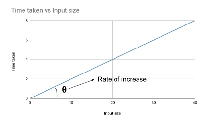
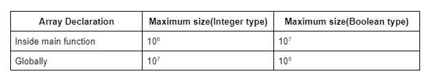

# Points to note

1. We must be careful that we will not manipulate the given data. A company may use the same data for different purposes. So, we will never manipulate the given data i.e. the inputs until the interviewer specifically says so.

2.  In CP or in the platforms like Leetcode and GeeksforGeeks, we generally run our codes on online servers. Most of these servers execute roughly **10<sup>8</sup>** (i.e. 1 crore) operations in approximately **1_second** i.e. 1s. 

     We must be careful that if the time limit is given as **2s** the operations in our code must be roughly **2 * 10<sup>8</sup>**, not 10<sup>16</sup>. 
     
     Simply, if we want our code to be run in **1s**, the time complexity of our code must be around **O(10<sup>8</sup>)** avoiding the constants and the lower values.

3. 10<sup>8</sup> operations take 1 second to get executed. So, 10<sup>10</sup> operations will take around 100 seconds(10<sup>10</sup>/10<sup>8</sup>). Code will get TLE if it takes 100 seconds to get executed.

4. C++ `Data-types` ref: https://www.programiz.com/cpp-programming/data-types

5. **Switch statementsS:** 

    A switch statement necessitates that its expression results in a **constant** value. This can include constants and arithmetic operations. 

    Ensure that the expression provides values of type `int` or `char` or `enum`. Switch statements in *C* or *C++* are exclusively designed to handle integer, character or enum values only.
 
 6. The rate at which the time, required to run a code, changes with respect to the input size, is considered the time complexity. Time complexity of a particular code depends on the given input size, not on the machine used to run the code.

    

7. Libraries:
     - **#include <bits/stdc++.h> :** Includes all popular library at once. But not available in all compilers.
     - std::swap() : swaps 2 pointers in the argument
     - #include<climits> : INT_MAX, INT_MIN

8. Shortcuts:
     - Initializing array filled with default values: int hash[13] = {0};
     - To print as Booleans:
     ```c
          cout << std::boolalpha; 
          cout << true << endl;
          cout << std::noboolalpha;
     ```
     - To find max element in an array: {    int maxE= *max_element(arr.begin(),arr.end());   }
     - To create heap from array in O(N):
     ```c++
          #include <algorithm>
          std::make_heap(arr.begin(), arr.end());
     ```
     - c++ priority_queue by default is max heap:
     ```c++
          #include <queue>
          std::priority_queue<int> pq;
          // Add elements to the priority queue
          pq.push(30);
          pq.push(100);

          // Remove elements from the priority queue
          while (!pq.empty()) {
               std::cout << "Popping: " << pq.top() << std::endl;
               pq.pop();
          }
     ```
     -  To use it as min_heap:
     ```c++
          #include <queue>
          std::priority_queue<int, std::vector<int>, std::greater<int>> minHeap;
          minHeap.push(30);
          minHeap.push(10);
          minHeap.push(50);
          minHeap.push(20);

          while (!minHeap.empty()) {
               std::cout << minHeap.top() << " ";
               minHeap.pop();
          }
     ```
     - To write 10^-6:
     ```c
          double diff = 1e-6;
     ```
     - proper alternative for (l+r)/2 :
     ```c
      int mid = l + (r - l) / 2;
     ```

> NOTE: While using ceil DO NOT FORGET to cast to double: ceil((`double`)N / 2);
-    
     - If you want to swap teo arrays based upon their size:
     
     ```c
     if (n < m)
            return findMedianSortedArrays(nums2, nums1);
     ```

     - 

1. 


1.  If the string contains both uppercase and lowercase letters: We have 256 characters in total in this case. So, we will create a hash array of size **256**. Otherwise we can use hash[s[i]-’a’] OR hash[s[i]-’A’] and keep the hash array of 26 elements only.

2.  In the map data structure, the data type of key can be anything like int, double, pair<int, int>, etc. But for unordered_map the data type is limited to integer, double, string, etc. We cannot have an unordered_map whose key is pair<int, int>. 

3.  How to traverse map from end to start?
     Ans: 

     ```c++
          for(auto it=freq.rbegin(); it!=freq.rend(); it++){
            cout<<it->first<<endl;
          }
     ```

4.  XOR properties:
     - XOR of two same numbers is always 0 i.e. a ^ a = 0. ←Property 1.
     - XOR of a number with 0 will result in the number itself i.e. 0 ^ a = a.  ←Property 2

5.  Sub-array vs sub-sequence:
    - A subarray is a contiguous (consecutive) portion of an array.
    - A subsequence is a sequence of elements derived from the original array by deleting some elements without changing the order of the remaining elements.

6.  When input array is given as sorted, then try to use Binary search.
7.  When we have to find the <b>minimum</b> number which is greater than or equal to something, try to use Binary search. And vice-versa for largest number less than equals to something. And also perform the binary search on the range of that asked value only from its min to max range.
8. How to rotate an array or a string? (`O(N)`)
     - Use built-in function rotate(first,middle, last) where
       - first: fist iterator in the range of elements to rotate
       - last: last iterator in the range of elements to rotate
       - middle: Iterator pointing to the element that should apprear at the begining of the rotated range
     - Example to left-rotate a string ("abcde") by 3 positions. Output: "deabc"
     ```cpp
          string s = "abcde";
          int d=3;
          rotate(s.begin(), (s.begin()+d) , s.end());
          cout<<s<<endl;
     ```
     - Example to right-rotate a string ("abcde") by 3 positions. Output: "cdeab"
     
     ```cpp
          string s = "abcde";
          int d=3;  int N=s.length();
          rotate(s.begin(), (s.begin()+(N-d)) , s.end());
          cout<<s<<endl;
     ```

9. string substr (size_t pos = 0, size_t len = npos) const;
     - pos: Position of the first character to be copied as a substring.
     - len: Number of characters to include in the substring
     - Example: 
     ```cpp
          // left rotate by i places each at a time
          // abcde -> bcdea -> cdeab -> deabc -> eabcd -> abcde
          for(int i=0; i<N; i++){
            int d = i;
            string leftShiftedStr = s.substr(d,(N-d)) + s.substr(0, d);
            cout<<leftShiftedStr;
          }

          // Right rotate by i places each at a time
          // abcde -> eabcd -> deabc -> cdeab -> bcdea -> abcde
          for(int i=0; i<N; i++){
            int d = i;
            string rightShiftedStr = s.substr(N-d, d) + s.substr(0, (N-d));
            cout<<rightShiftedStr;
          }
     ```

10.  


---
### Some tricky problems to revise:

1. 074-Minimize Max Distance to Gas Station
2. 075-Median of 2 sorted arrays
3. 078-Find Peak Element in 2D Matrix
4. 079-Median of Row Wise Sorted Matrix
5. 